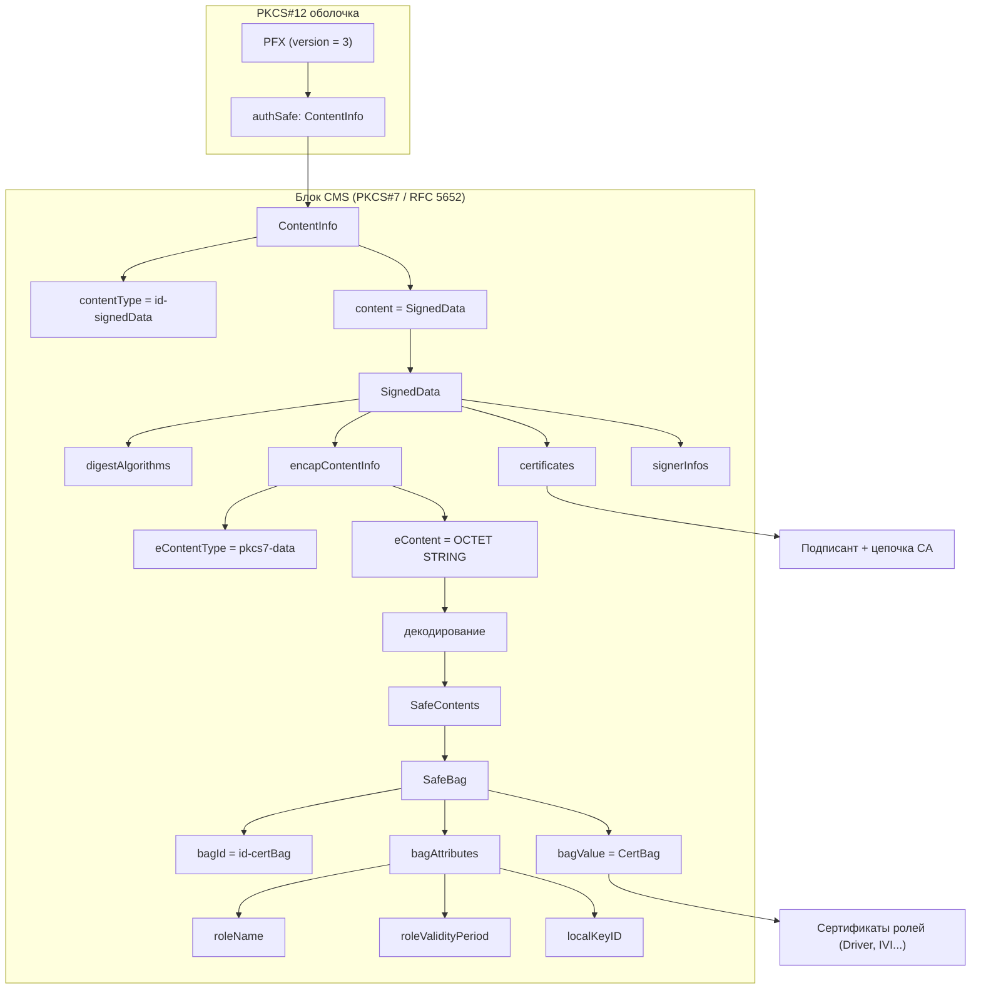

# Архитектурные решения (ADR): реестры ATOM-PKCS12-REGISTRY

Документ фиксирует **архитектурные решения** для формата **ATOM-PKCS12-REGISTRY** (.p12) и требований к внешним сервисам работы с реестрами. Спецификация структуры данных задана в [registry.asn1](../registry.asn1). Утилиты проекта (registry-analyzer, registry-builder, p7-analyzer) являются эталонной реализацией этих решений.

---

## Содержание ADR

| ADR                                                                                          | Название                                                          |
| -------------------------------------------------------------------------------------------- | ------------------------------------------------------------------------- |
| [ADR-001](#adr-001-контейнер-pkcs12-pfx-версия-3)                                | Контейнер PKCS#12 (PFX), версия 3                          |
| [ADR-002](#adr-002-authsafe-как-один-contentinfo)                                        | authSafe как один ContentInfo                                      |
| [ADR-003](#adr-003-тело-cms-signeddata-в-authsafe)                                         | Тело CMS (SignedData) в authSafe                                     |
| [ADR-004](#adr-004-два-источника-сертификатов)                          | Два источника сертификатов                        |
| [ADR-005](#adr-005-econtent-как-safecontents-safebag)                                        | eContent как SafeContents / SafeBag                                    |
| [ADR-006](#adr-006-идентификация-подписанта-по-subjectkeyidentifier)   | Идентификация подписанта по SubjectKeyIdentifier |
| [ADR-007](#adr-007-атрибуты-atom-vin-ver-uid-rolename-rolevalidityperiod)               | Атрибуты ATOM (VIN, VER, UID, roleName, roleValidityPeriod)       |
| [ADR-008](#adr-008-именование-и-сборка-реестров)                       | Именование и сборка реестров                     |
| [ADR-009](#adr-009-разбор-без-пароля-macdata-опционально)             | Разбор без пароля (macData опционально)         |
| [ADR-010](#adr-010-конфигурация-утилит-флаги-и-конфиг-без-env) | Поддержка формата .p7 отдельно от .p12          |

Дополнительно: [Приложение A — Справочник формата](#приложение-a--справочник-формата-registryasn1), [Приложение B — Требования к сервисам](#приложение-b--требования-к-сервисам), [Ссылки](#ссылки-на-документацию).

---

## ADR-001: Контейнер PKCS#12 (PFX), версия 3

- **Статус:** Принято
- **Контекст:** Нужен единый контейнер для распространения подписанных наборов сертификатов (реестров ролей) с гарантией целостности и происхождения.
- **Решение:** Использовать формат **PKCS#12** (RFC 7292): внешний тип — **PFX** с **version = 3**. Файл реестра — **.p12** (DER). Внутри PFX поле **authSafe** несёт основное содержимое; **macData** опционально и для типичных реестров не используется.
- **Последствия:** Все клиенты и сервисы должны поддерживать разбор PFX версии 3; отказ при иной версии. Совместимость с индустриальным стандартом PKCS#12.

---

## ADR-002: authSafe как один ContentInfo

- **Статус:** Принято
- **Контекст:** В классическом PKCS#12 authSafe может быть SEQUENCE OF ContentInfo (несколько блоков). В ATOM-реестрах всё подписанное содержимое упаковано в один блок CMS.
- **Решение:** **authSafe** — один объект типа **ContentInfo** (не SEQUENCE OF). В нём **contentType = id-signedData** (pkcs7-signedData), **content** — тело **SignedData** (CMS, RFC 5652).
- **Последствия:** Парсеры не должны предполагать AuthenticatedSafe из RFC 7292; проверять тип и ожидать ровно один ContentInfo с id-signedData.

---

## ADR-003: Тело CMS (SignedData) в authSafe

- **Статус:** Принято
- **Контекст:** Нужна криптографическая подпись и явная структура подписанных данных (алгоритмы, сертификаты, подписанты).
- **Решение:** Содержимое **content** в ContentInfo — **SignedData** (CMS): **digestAlgorithms**, **encapContentInfo** (eContent), **certificates**, **signerInfos**. Блок от ContentInfo до конца signerInfos образует **один непрерывный фрагмент CMS** внутри authSafe.
- **Последствия:** Реализации опираются на RFC 5652 для проверки подписи и порядка атрибутов. eContent трактуется по eContentType (в реестре — pkcs7-data).

**Диаграмма иерархии контейнера (.p12) — полная:**



**Текстовая схема уровней структуры контейнера (.p12) — полная.** Связи читаются сверху вниз; "->" — «значение поля после декодирования даёт». Рамка ограничивает единый блок CMS.

```
  .p12 (DER)
  |
  +-- PFX (version = 3) ................................. PKCS#12
  |   |
  |   +-- version ..................... целое 3
  |   +-- authSafe .................... один ContentInfo (не SEQUENCE OF)
  |   |   |
  |   |   +==============================================================+
  |   |   |  БЛОК CMS (PKCS#7, RFC 5652): ContentInfo .. signerInfos     |
  |   |   +==============================================================+
  |   |   |
  |   |   +-- ContentInfo
  |   |       +-- contentType ........... id-signedData (pkcs7-signedData)
  |   |       +-- content [0] ........... SignedData
  |   |           |
  |   |           +-- SignedData
  |   |               +-- version
  |   |               +-- digestAlgorithms .... SET OF (напр. SHA-256)
  |   |               +-- encapContentInfo
  |   |               |   +-- eContentType ..... pkcs7-data
  |   |               |   +-- eContent [0] ..... OCTET STRING
  |   |               |       |
  |   |               |       +-- декодирование -> SafeContents
  |   |               |           +-- SafeContents .. SEQUENCE OF SafeBag
  |   |               |               |
  |   |               |               +--- Уровень хранения : сертификаты ролей ----
  |   |               |               |     (Driver, IVI ... в bagValue)
  |   |               |               |
  |   |               |               +-- SafeBag (на каждый элемент)
  |   |               |                   +-- bagId ......... id-certBag
  |   |               |                   +-- bagValue ...... CertBag (X.509)
  |   |               |                   +-- bagAttributes . roleName,
  |   |               |                                     roleValidityPeriod,
  |   |               |                                     localKeyID
  |   |               |
  |   |               ============== Уровень хранения: подписант + CA ====================
  |   |   
  |   |               +-- certificates [0] .. SET OF Certificate (X.509 DER)
  |   |               |     подписант + цепочка CA
  |   |               |
  |   |               +-- signerInfos ........ SET OF SignerInfo
  |   |                     sid, digestAlgorithm, authenticatedAttributes,
  |   |                     digestEncryptionAlgorithm, encryptedDigest
  |   |               =====================================================================
  |   +-- macData (опционально) ....................... снова PKCS#12
```

**Кратко по связям:**

| От кого                        | Связь                                     | К чему                                                                   |
| ------------------------------------ | ---------------------------------------------- | ----------------------------------------------------------------------------- |
| PFX.authSafe                         | является                               | ContentInfo                                                                   |
| ContentInfo.content                  | является                               | SignedData                                                                    |
| SignedData.encapContentInfo.eContent | после декодирования даёт | SafeContents (SEQUENCE OF SafeBag)                                            |
| SafeContents                         | список элементов                | SafeBag (CertBag + атрибуты мешка)                               |
| SignedData.certificates              | список                                   | X.509 сертификаты (подписант и CA)                       |
| SignedData.signerInfos               | список                                   | SignerInfo (подписанты с атрибутами и подписью) |

---

## ADR-004: Два источника сертификатов

- **Статус:** Принято
- **Контекст:** В CMS сертификаты могут находиться в SignedData.certificates; при этом в ATOM-реестрах полезные данные (сертификаты ролей) размещаются внутри подписанного eContent.
- **Решение:** Сертификаты в реестре хранятся в **двух местах**:
  1. **SignedData.certificates** — сертификат подписанта и при необходимости цепочка CA (X.509 DER). Не внутри SafeBag.
  2. **eContent → SafeContents → SafeBag** — сертификаты ролей (Driver, Passenger, IVI и т.д.), по одному в каждом SafeBag, в **bagValue** (CertBag), с атрибутами мешка.
- **Последствия:** Парсеры и сервисы должны обрабатывать оба слоя раздельно; экспорт и валидация учитывают оба источника. Эталон: registry-analyzer извлекает оба слоя и позволяет экспортировать по отдельности.

**Диаграмма двух источников сертификатов — полная:**


**Таблица двух источников (полная):**

| В структуре CMS                     | Что там лежит                                                                                                                                                                                       | В SafeBag?                                                   |
| --------------------------------------------- | -------------------------------------------------------------------------------------------------------------------------------------------------------------------------------------------------------------- | ------------------------------------------------------------- |
| **SignedData.certificates**             | Сертификат подписанта и при необходимости цепочка CA (X.509).                                                                                                      | **Нет** — отдельное поле SignedData.   |
| **eContent → SafeContents → SafeBag** | Сертификаты ролей (Driver, Passenger, IVI и т.д.) — по одному в каждом SafeBag, вместе с атрибутами мешка (roleName, roleValidityPeriod, localKeyID). | **Да** — в bagValue (CertBag) внутри SafeBag. |

**Примечание:** SafeBags используются в контейнере **.p12** (ATOM-PKCS12-REGISTRY). В файлах **.p7** (голый CMS без обёртки PFX) eContent может быть в другом формате (например PEM-цепочки, не SafeBags).

---

## ADR-005: eContent как SafeContents / SafeBag

- **Статус:** Принято
- **Контекст:** Нужен стандартный способ хранить сертификаты ролей с метаданными (имя роли, срок действия, идентификатор).
- **Решение:** В реестрах **.p12** значение **eContent** (OCTET STRING в encapContentInfo) после декодирования — **SafeContents** (SEQUENCE OF SafeBag) по PKCS#12. Каждый **SafeBag**: **bagId = id-certBag**, **bagValue** = CertBag (X.509 DER), **bagAttributes** — roleName, roleValidityPeriod (GeneralizedTime), localKeyID (OCTET STRING), при необходимости friendlyName.
- **Последствия:** eContentType должен быть id-data (pkcs7-data). Парсеры декодируют eContent как DER-кодированную SafeContents. Формат .p7 может использовать иное представление eContent (например PEM); для .p12 строго SafeContents/SafeBag по [registry.asn1](../registry.asn1).

**Текстовая  eContent и SafeBag :**

```
  SignedData
  |
  +-- encapContentInfo
  |   +-- eContentType ............... id-data (pkcs7-data)
  |   +-- eContent [0] ............... OCTET STRING (DER)
  |       |
  |       +-- декодирование -> SafeContents = SEQUENCE OF SafeBag
  |           |
  |           +-- SafeBag (для каждого элемента списка)
  |               +-- bagId ............ id-certBag
  |               +-- bagValue [0] ..... CertBag
  |               |   +-- certId ....... тип (x509Certificate / sdsiCertificate)
  |               |   +-- certValue [0]  OCTET STRING (X.509 DER)
  |               +-- bagAttributes .... SET OF Attribute (опционально)
  |                   +-- roleName .............. UTF8String
  |                   +-- roleValidityPeriod .... notBeforeTime, notAfterTime (GeneralizedTime)
  |                   +-- localKeyID ............ OCTET STRING
  |                   +-- friendlyName ......... (опционально)
  |
  +-- certificates [0] .............. подписант + цепочка CA (МЕСТО 1)
  +-- signerInfos ..................... SET OF SignerInfo
```

**Связь типов eContent → SafeBag:**

| От кого             | Связь                                     | К чему                                            |
| ------------------------- | ---------------------------------------------- | ------------------------------------------------------ |
| encapContentInfo.eContent | после декодирования даёт | SafeContents (SEQUENCE OF SafeBag)                     |
| SafeContents              | список элементов                | SafeBag                                                |
| SafeBag.bagId             | значение                               | id-certBag                                             |
| SafeBag.bagValue          | значение                               | CertBag (certId + certValue = X.509 DER)               |
| SafeBag.bagAttributes     | опционально                         | roleName, roleValidityPeriod, localKeyID, friendlyName |

---

## ADR-006: Идентификация подписанта по SubjectKeyIdentifier

- **Статус:** Принято
- **Контекст:** В SignerInfo подписант может быть задан IssuerAndSerialNumber или SubjectKeyIdentifier. Нужен однозначный и простой способ находить сертификат подписанта.
- **Решение:** В формате реестра в **SignerInfo.sid** используется вариант **[0] SubjectKeyIdentifier** (OCTET STRING). Сервис определяет сертификат подписанта поиском в **SignedData.certificates** сертификата с совпадающим расширением SubjectKeyId.
- **Последствия:** Все парсеры и проверки подписи должны извлекать SubjectKeyId из sid и искать соответствующий сертификат в certificates. IssuerAndSerialNumber в данном формате не используется.

---

## ADR-007: Атрибуты ATOM (VIN, VER, UID, roleName, roleValidityPeriod)

- **Статус:** Принято
- **Контекст:** Нужны единые атрибуты для идентификации реестра (VIN, версия, UID подписанта) и ролей (имя роли, срок действия).
- **Решение:** Ввести enterprise-атрибуты под веткой **atom-attributes** (1.3.6.1.4.1.99999.1): **VIN**, **VER** (timestamp + versionNumber), **UID**, **roleName**, **roleValidityPeriod** (notBeforeTime, notAfterTime). Они размещаются в **SignerInfo.authenticatedAttributes** и при необходимости в **SafeBag.bagAttributes**. Типы и OID заданы в [registry.asn1](../registry.asn1); см. [Приложение A](#приложение-a--справочник-формата-registryasn1).
- **Последствия:** Проверка подписи должна учитывать порядок атрибутов при расчёте messageDigest (RFC 5652). Сервисы, собирающие реестры, обязаны формировать authenticatedAttributes в том же порядке. Сроки ролей проверяются по roleValidityPeriod.

---

## ADR-008: Именование и сборка реестров

- **Статус:** Принято
- **Контекст:** Нужны согласованные правила формирования реестров и именования файлов для совместимости и автоматизации.
- **Решение:**
  - Выходные файлы реестров создаются  на основе структуры  ASN.1 (registry.asn1 ). Для реестров типа ***owner*** - имя файла : owner.p12, для реестров типа ***regular*** - имя файла содержит : [имя пользователя/сервиса из реестра ***owner***] +regular.p12 , как пример : ivi_user-regular.p12
  - Сборка: подписант (сертификат + ключ PEM), атрибуты подписанта (VIN, VER, UID), список SafeBags (сертификат + roleName, roleNotBefore/roleNotAfter, localKeyID). Конфиг — JSON по [REGISTRY_BUILDER.md](REGISTRY_BUILDER.md).
  - Криптография: ECDSA P-256, SHA-256 в текущей реализации. Созданный реестр должен успешно разбираться registry-analyzer.
- **Последствия:** Интеграции и скрипты могут полагаться на префикс sgw- для обнаружения реестров. Эталон сборки — internal/registry/builder.go.

---

## ADR-009: Разбор без пароля (macData опционально)

- **Статус:** Принято
- **Контекст:** Классический PKCS#12 часто используется с паролем и macData. Реестры ATOM-PKCS12-REGISTRY типично распространяются без защиты паролем.
- **Решение:** **macData** в PFX считать **опциональным**. Парсеры не должны требовать пароль для разбора типичного реестра; при отсутствии macData разбор и извлечение сертификатов выполняются без пароля.
- **Последствия:** Упрощение интеграции; сервисы не обязаны запрашивать или хранить пароль для чтения реестров.

---

## ADR-10: Поддержка формата .p7 отдельно от .p12

- **Статус:** Принято
- **Контекст:** Существуют контейнеры «голого» CMS (.p7) без обёртки PFX, в т.ч. с eContent в виде PEM-сертификатов (списки пининга), а не SafeContents.
- **Решение:** Формат **.p7** рассматривать как **отдельный** от реестров .p12. Сервисам, работающим только с ATOM-PKCS12-REGISTRY, достаточно поддержки формата по registry.asn1. Для анализа .p7 предусмотрена отдельная утилита **p7-analyzer**; общие принципы CMS (SignedData.certificates, eContent, идентификация подписанта по SubjectKeyIdentifier) сохраняются. При JSON-выводе для .p7 включать поле **pem** у каждого сертификата.
- **Последствия:** Два формата документируются и обрабатываются раздельно; при необходимости поддержки обоих в одном сервисе это явно указывается в документации.

---

## Приложение A — Справочник формата (registry.asn1)

Спецификация: [registry.asn1](../registry.asn1). Ниже — полные схемы и таблицы.

### Уровни структуры (полная таблица)

| Уровень           | Описание                                                                                                                                                                                                                                |
| ------------------------ | ----------------------------------------------------------------------------------------------------------------------------------------------------------------------------------------------------------------------------------------------- |
| **Внешний** | Файл .p12 — контейнер**PFX** (PKCS#12), version 3.                                                                                                                                                                          |
| **authSafe**       | Один**ContentInfo** с `contentType = pkcs7-signedData` (не стандартный AuthenticatedSafe из RFC 7292).                                                                                                              |
| **Тело**       | **SignedData** (CMS, RFC 5652): digestAlgorithms, encapContentInfo (eContent), certificates, signerInfos.                                                                                                                                 |
| **eContent**       | Тип pkcs7-data; значение после декодирования —**SafeContents** (SEQUENCE OF SafeBag). В каждом SafeBag — CertBag с X.509 и атрибуты (roleName, roleValidityPeriod, localKeyID и т.д.). |
| **Подпись** | SignerInfo с sid (SubjectKeyIdentifier), authenticatedAttributes (VIN, VER, UID, roleName, roleValidityPeriod, contentType, messageDigest).                                                                                                    |

### OID — полная таблица (из registry.asn1)

| OID                        | Имя                     | Описание                   |
| -------------------------- | -------------------------- | ---------------------------------- |
| 1.2.840.113549.1.7         | pkcs-7                     | PKCS#7 (CMS)                       |
| 1.2.840.113549.1.7.1       | id-data                    | pkcs7-data                         |
| 1.2.840.113549.1.7.2       | id-signedData              | pkcs7-signedData                   |
| 1.2.840.113549.1.9         | pkcs-9                     | Атрибуты PKCS#9            |
| 1.2.840.113549.1.9.3       | id-contentType             | contentType                        |
| 1.2.840.113549.1.9.4       | id-messageDigest           | messageDigest                      |
| 1.2.840.113549.1.9.20      | id-friendlyName            | friendlyName                       |
| 1.2.840.113549.1.9.21      | id-localKeyID              | localKeyID                         |
| 1.2.840.113549.1.12        | pkcs-12                    | PKCS#12                            |
| 1.2.840.113549.1.12.10.1.3 | id-certBag                 | CertBag                            |
| 1.3.6.1.4.1.99999.1        | atom-attributes            | Атрибуты ATOM (enterprise) |
| 1.3.6.1.4.1.99999.1.1      | id-atom-vin                | VIN                                |
| 1.3.6.1.4.1.99999.1.2      | id-atom-ver                | VER (версия/время)      |
| 1.3.6.1.4.1.99999.1.3      | id-atom-uid                | UID                                |
| 1.3.6.1.4.1.99999.1.4      | id-atom-roleName           | roleName                           |
| 1.3.6.1.4.1.99999.1.5      | id-atom-roleValidityPeriod | roleValidityPeriod                 |

**Типы сертификатов в CertBag:** x509Certificate (1.2.840.113549.1.9.22.1), sdsiCertificate (1.2.840.113549.1.9.22.2).

### Схема типов ASN.1 — полная


### Структуры по registry.asn1 (полное описание)

- **PFX (PKCS#12):** version (3), authSafe (ContentInfo), macData (опционально). authSafe — один объект ContentInfo (в ATOM-PKCS12-REGISTRY не SEQUENCE OF ContentInfo).
- **ContentInfo (authSafe):** contentType = id-signedData (1.2.840.113549.1.7.2); content [0] — тело типа SignedData (CMS).
- **SignedData (CMS):** version, digestAlgorithms (SET OF AlgorithmIdentifier); encapContentInfo: eContentType = id-data (pkcs7-data), eContent [0] = OCTET STRING (после декодирования — SafeContents); certificates [0] — опционально, SET OF Certificate (X.509 DER); signerInfos — SET OF SignerInfo.
- **SignerInfo:** sid — в формате реестра [0] SubjectKeyIdentifier; authenticatedAttributes — SET OF Attribute (contentType, messageDigest, атрибуты ATOM); digestAlgorithm, digestEncryptionAlgorithm, encryptedDigest.
- **SafeContents:** SEQUENCE OF SafeBag.
- **SafeBag:** bagId = id-certBag, bagValue [0] = CertBag, bagAttributes (опционально). CertBag: certId (тип сертификата), certValue [0] = OCTET STRING (DER X.509). bagAttributes — roleName, roleValidityPeriod (GeneralizedTime), localKeyID (OCTET STRING), friendlyName (опционально).
- **Кодирование:** certificates в SignedData в ASN.1 — [0] IMPLICIT; в реализации может использоваться SET или SEQUENCE. Длины в DER — минимальное число байт. authenticatedAttributes кодируются как SET OF и участвуют в расчёте messageDigest.

### Атрибуты ATOM (типы значений) — полная таблица

| Атрибут     | OID                   | Тип значения (ASN.1)                                          | Назначение                                                   |
| ------------------ | --------------------- | ------------------------------------------------------------------------ | ---------------------------------------------------------------------- |
| VIN                | 1.3.6.1.4.1.99999.1.1 | UTF8String                                                               | Идентификатор транспортного средства |
| VER                | 1.3.6.1.4.1.99999.1.2 | SEQUENCE { timestamp GeneralizedTime, versionNumber INTEGER }            | Время и номер версии реестра                   |
| UID                | 1.3.6.1.4.1.99999.1.3 | UTF8String                                                               | Идентификатор подписанта                        |
| roleName           | 1.3.6.1.4.1.99999.1.4 | UTF8String                                                               | Имя роли (у подписанта или в мешке)         |
| roleValidityPeriod | 1.3.6.1.4.1.99999.1.5 | SEQUENCE { notBeforeTime GeneralizedTime, notAfterTime GeneralizedTime } | Срок действия роли                                     |

В SignerInfo также присутствуют стандартные атрибуты: contentType (pkcs9), messageDigest (OCTET STRING).

### Кодирование

- certificates в SignedData: [0] IMPLICIT; в реализации — SET или SEQUENCE.
- Длины в DER — минимальное число байт.
- authenticatedAttributes — SET OF, участвуют в расчёте messageDigest (RFC 5652).

---

## Приложение B — Требования к внешним сервисам (out of car)

Требования сформулированы по поведению registry-analyzer, registry-builder и p7-analyzer. Рекомендуемые модули для анализа: internal/registry/parse.go, internal/registry/builder.go.

### 1. Разбор контейнера (.p12)

- Версия PFX = 3; иначе ошибка.
- authSafe — один ContentInfo, contentType = id-signedData.
- Два слоя сертификатов обрабатывать раздельно (SignedData.certificates и eContent/SafeContents).
- Подписант — по SignerInfo.sid (SubjectKeyIdentifier), поиск в SignedData.certificates.
- eContentType = id-data; eContent декодировать как SafeContents (SEQUENCE OF SafeBag).
- Пароль не требуется (macData опционально).

### 2. Валидация и целостность

- Разбор строго по registry.asn1; лишние байты после PFX — ошибка.
- Проверка подписи: сертификат подписанта из certificates, алгоритмы и порядок атрибутов по RFC 5652.
- Проверка сроков сертификатов и roleValidityPeriod при наличии.

### 3. Сборка реестров (.p12)

- Конфиг: signerCert, signerKey (PEM), VIN, VER, UID, safeBags (cert, roleName, roleNotBefore/roleNotAfter, localKeyID). Формат — [REGISTRY_BUILDER.md](REGISTRY_BUILDER.md), пример [registry-builder-config.example.json](registry-builder-config.example.json).
- Подписант в certificates; SignerInfo с sid = SubjectKeyIdentifier, authenticatedAttributes в порядке для проверки подписи; ECDSA P-256.
- SafeBags: bagId = id-certBag, CertBag (x509Certificate), bagAttributes (roleName, roleValidityPeriod, localKeyID).
- Имя выходного файла с префиксом sgw-. После сборки — проверка разбором (registry-analyzer).

### 4. Экспорт и интеграция

- PEM: один файл или по одному на сертификат; имена по roleName/Serial (см. registry-analyzer).
- JSON: метаданные, сертификаты (subject, issuer, serial, сроки, DER/PEM), SafeBags с атрибутами, подписанты и атрибуты; для .p7 — поле **pem** у каждого сертификата.
- Возможность экспорта только сертификата подписанта.

### 5. Формат .p7

- .p7 — отдельный формат; eContent может быть не SafeContents (напр. PEM). Для .p12 — только registry.asn1.
- Общие принципы: certificates, eContent, идентификация по SubjectKeyIdentifier; в JSON — PEM-блоки сертификатов.

### 6. Окружение и зависимости

- Утилиты: без переменных окружения; флаги и (для registry-builder) JSON-конфиг; пути относительно CWD.
- Рекомендации для сервисов: документировать любые переменные окружения; предпочтительно абсолютные пути или явная база (напр. REGISTRY_BASE_DIR); учитывать NO_COLOR при цветном выводе; ECDSA P-256, SHA-256; повторяемость при фиксированном CWD или абсолютных путях.

---

## Связь с утилитами проекта для детализации требований при разработке внешних сервисов (out fo car)

| Утилита              | Назначение в архитектуре                                                                                                                        |
| --------------------------- | --------------------------------------------------------------------------------------------------------------------------------------------------------------------- |
| **registry-analyzer** | Разбор .p12, оба слоя сертификатов, атрибуты подписанта и SafeBags; экспорт PEM/JSON. Эталон парсера. |
| **registry-builder**  | Сборка .p12 по конфигу; подписант, атрибуты, SafeBags. Эталон сборки.                                                     |
| **p7-analyzer**       | Анализ «чистого» CMS (.p7); те же принципы CMS.                                                                                            |

---

## Ссылки на документацию

| Документ                            | Описание                                                                      |
| ------------------------------------------- | ------------------------------------------------------------------------------------- |
| [registry.asn1](../registry.asn1)              | Спецификация ASN.1 формата ATOM-PKCS12-REGISTRY.                   |
| [README.md](../README.md)                      | Обзор утилит, запуск, опции.                                    |
| [WORKFLOW.md](WORKFLOW.md)                     | Пошаговый workflow анализа контейнера PKCS#12.              |
| [REGISTRY_BUILDER.md](REGISTRY_BUILDER.md)     | Инструкция по registry-builder (конфиг, SafeBags, примеры).  |
| [PKCS7_CMS_ANALYSIS.md](PKCS7_CMS_ANALYSIS.md) | Анализ формата CMS (.p7), отличия от .p12.                      |
| [OPENSSL_VERIFY.md](OPENSSL_VERIFY.md)         | Проверка контейнера и сертификатов через OpenSSL. |

---

**ATOM CA Team 2025**
