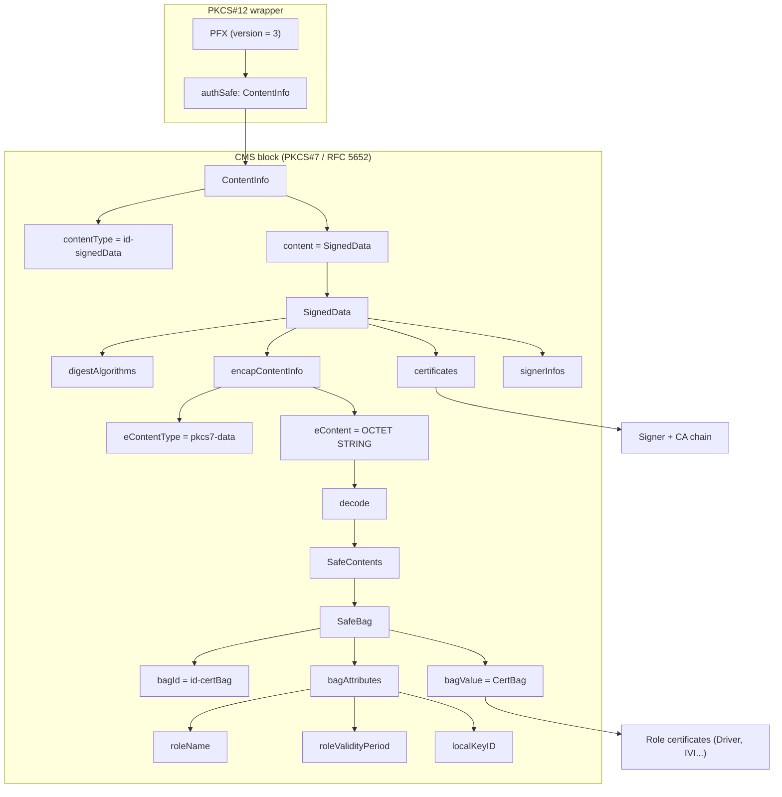
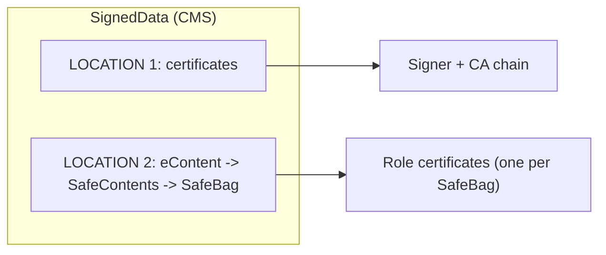
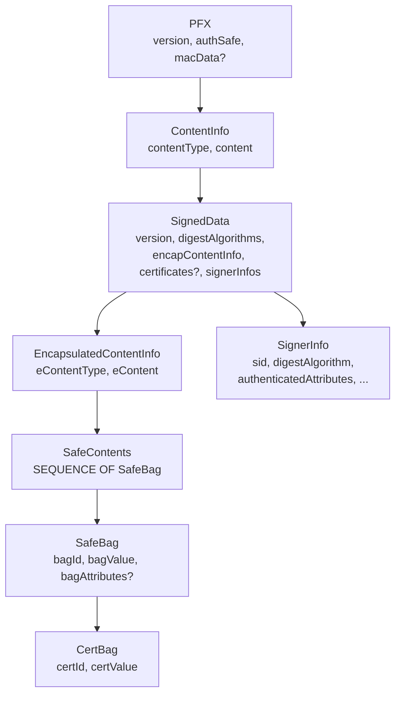

# Architectural Decision Records (ADR): ATOM-PKCS12-REGISTRY

This document records **architectural decisions** for the **ATOM-PKCS12-REGISTRY** (.p12) format and requirements for external services that work with registries. The data structure specification is defined in [registry.asn1](../registry.asn1). The project utilities (registry-analyzer, registry-builder, p7-analyzer) are the reference implementation of these decisions.

---

## ADR Index

| ADR                                                                      | Title                                                         |
| ------------------------------------------------------------------------ | ------------------------------------------------------------- |
| [ADR-001](#adr-001-pkcs12-container-pfx-version-3)                          | PKCS#12 container (PFX), version 3                            |
| [ADR-002](#adr-002-authsafe-as-single-contentinfo)                          | authSafe as single ContentInfo                                |
| [ADR-003](#adr-003-cms-signeddata-body-in-authsafe)                         | CMS SignedData body in authSafe                               |
| [ADR-004](#adr-004-two-certificate-sources)                                 | Two certificate sources                                       |
| [ADR-005](#adr-005-econtent-as-safecontents-safebag)                        | eContent as SafeContents / SafeBag                            |
| [ADR-006](#adr-006-signer-identification-by-subjectkeyidentifier)           | Signer identification by SubjectKeyIdentifier                 |
| [ADR-007](#adr-007-atom-attributes-vin-ver-uid-rolename-rolevalidityperiod) | ATOM attributes (VIN, VER, UID, roleName, roleValidityPeriod) |
| [ADR-008](#adr-008-naming-and-building-registries)                          | Naming and building registries                                |
| [ADR-009](#adr-009-parsing-without-password-macdata-optional)               | Parsing without password (macData optional)                   |
| [ADR-010](#adr-010-support-for-p7-format-separate-from-p12)                 | Support for .p7 format separate from .p12                     |
| [ADR-011](#adr-011-reference-structure-compatibility-der-encoding)           | Reference structure compatibility (DER encoding)             |

See also: [Appendix A — Format reference](#appendix-a--format-reference-registryasn1), [Appendix B — Service requirements](#appendix-b--requirements-for-external-services), [References](#documentation-references).

---

## ADR-001: PKCS#12 container (PFX), version 3

- **Status:** Accepted
- **Context:** A single container is needed to distribute signed certificate sets (role registries) with guaranteed integrity and origin.
- **Decision:** Use **PKCS#12** format (RFC 7292): top-level type **PFX** with **version = 3**. Registry file extension is **.p12** (DER). Inside PFX, the **authSafe** field carries the main content; **macData** is optional and typically not used for standard registries.
- **Consequences:** All clients and services must support parsing PFX version 3; reject any other version. Compatibility with the industry-standard PKCS#12.

---

## ADR-002: authSafe as single ContentInfo

- **Status:** Accepted
- **Context:** In classic PKCS#12, authSafe can be SEQUENCE OF ContentInfo (multiple blocks). In ATOM registries, all signed content is packed into one CMS block.
- **Decision:** **authSafe** is a single **ContentInfo** object (not SEQUENCE OF). It has **contentType = id-signedData** (pkcs7-signedData), and **content** is the **SignedData** body (CMS, RFC 5652).
- **Consequences:** Parsers must not assume AuthenticatedSafe from RFC 7292; must check the type and expect exactly one ContentInfo with id-signedData.

---

## ADR-003: CMS SignedData body in authSafe

- **Status:** Accepted
- **Context:** Cryptographic signature and an explicit structure for signed data (algorithms, certificates, signers) are required.
- **Decision:** The **content** of ContentInfo is **SignedData** (CMS): **digestAlgorithms**, **encapContentInfo** (eContent), **certificates**, **signerInfos**. The block from ContentInfo through the end of signerInfos forms **one continuous CMS fragment** inside authSafe. For reference-structure compatibility (see [ADR-011](#adr-011-reference-structure-compatibility-der-encoding)), **ContentInfo.content [0]** carries the **full SignedData TLV** (tag 0x30 SEQUENCE + length + body), not only the SEQUENCE body.
- **Consequences:** Implementations rely on RFC 5652 for signature verification and attribute order. eContent is interpreted according to eContentType (pkcs7-data in the registry). Parsers must accept both the full-SignedData form and (for legacy) content-only form in content [0].

**Full container hierarchy diagram (.p12):**



The document is consistent: the **CMS block** is the value of **authSafe**, i.e. one **ContentInfo** (from its first byte through the last byte of **signerInfos**). In other words:

| Layer (in .p12)                                                                                  | CMS block | Description                                                                                                            |
| ------------------------------------------------------------------------------------------------ | :-------: | ---------------------------------------------------------------------------------------------------------------------- |
| **PFX**, **version**, **authSafe** (as field)                                  |     -     | PKCS#12 (RFC 7292). authSafe is the*field* that holds the CMS.                                                       |
| **authSafe value** = **ContentInfo**                                                 |     X     | Start of CMS block.                                                                                                    |
| **ContentInfo.contentType**                                                                |     X     | id-signedData (pkcs7-signedData).                                                                                      |
| **ContentInfo.content [0]** = **SignedData**                                         |     X     | Full SignedData TLV (0x30 + length + body) for reference compatibility; see ADR-011.                                   |
| **SignedData**: version, digestAlgorithms, encapContentInfo, certificates [0], signerInfos |     X     | All of SignedData is inside the CMS block.                                                                             |
| **encapContentInfo.eContent [0]**                                                          |     X     | OCTET STRING (0x04 + length + SafeContents DER). Its *decoded* value is SafeContents → SafeBag; see ADR-011.         |

So the **CMS block** = **ContentInfo** (contentType + content [0]) = **ContentInfo .. signerInfos** as in the ASCII frame. The Mermaid subgraph “CMS block” therefore includes: the ContentInfo (authSafe value), its two fields (contentType and content = SignedData), and the whole SignedData tree down to signerInfos; the branch “decode → SafeContents → SafeBag” is the *semantic interpretation* of eContent, not an extra ASN.1 level in the CMS encoding.

**SafeBag (and its contents) inside the CMS block**. The **bytes** that encode SafeContents (SEQUENCE OF SafeBag), and thus every SafeBag (bagId, bagValue = CertBag, bagAttributes), are the **value** of the CMS field **eContent** (OCTET STRING). So physically they lie inside SignedData, i.e. inside the CMS block. The **type** SafeBag is defined by PKCS#12 (RFC 7292) and [registry.asn1](../registry.asn1), not by CMS (RFC 5652): CMS only specifies that eContent is an OCTET STRING. In ATOM-PKCS12-REGISTRY we agree that this string is the DER of SafeContents (SafeBag, CertBag, bagAttributes). So: SafeBag and everything in it are inside the CMS/PKCS#7 block as the **payload** of eContent.

**Container structure levels (.p12).** Read top to bottom; "->" means "field value after decoding yields". The frame denotes the single CMS block.

```
  .p12 (DER)
  |
  +-- PFX (version = 3) ................................. PKCS#12
  |   |
  |   +-- version ..................... integer 3
  |   +-- authSafe .................... single ContentInfo (not SEQUENCE OF)
  |   |   |
  |   |   +==============================================================+
  |   |   |  CMS BLOCK (PKCS#7, RFC 5652): ContentInfo .. signerInfos     |
  |   |   +==============================================================+
  |   |   |
  |   |   +-- ContentInfo
  |   |       +-- contentType ........... id-signedData (pkcs7-signedData)
  |   |       +-- content [0] ........... SignedData
  |   |           |
  |   |           +-- SignedData
  |   |               +-- version
  |   |               +-- digestAlgorithms .... SET OF (e.g. SHA-256)
  |   |               +-- encapContentInfo
  |   |               |   +-- eContentType ..... pkcs7-data
  |   |               |   +-- eContent [0] ..... OCTET STRING
  |   |               |       |
  |   |               |       +-- decode -> SafeContents
  |   |               |           +-- SafeContents .. SEQUENCE OF SafeBag
  |   |               |               |
  |   |               |               +--- Storage: role certificates ----
  |   |               |               |     (Driver, IVI ... in bagValue)
  |   |               |               |
  |   |               |               +-- SafeBag (per list element)
  |   |               |                   +-- bagId ......... id-certBag
  |   |               |                   +-- bagValue ...... CertBag (X.509)
  |   |               |                   +-- bagAttributes . roleName,
  |   |               |                                     roleValidityPeriod,
  |   |               |                                     localKeyID
  |   |               |
  |   |               ============== Storage: signer + CA ====================
  |   |   
  |   |               +-- certificates [0] .. SET OF Certificate (X.509 DER)
  |   |               |     signer + CA chain
  |   |               |
  |   |               +-- signerInfos ........ SET OF SignerInfo
  |   |                     sid, digestAlgorithm, authenticatedAttributes,
  |   |                     digestEncryptionAlgorithm, encryptedDigest
  |   |               =====================================================================
  |   ........................................................................................  PKCS#12
```

**Relationship summary:**

| From                                 | Relationship        | To                                                 |
| ------------------------------------ | ------------------- | -------------------------------------------------- |
| PFX.authSafe                         | is                  | ContentInfo                                        |
| ContentInfo.content                  | is                  | SignedData                                         |
| SignedData.encapContentInfo.eContent | after decode yields | SafeContents (SEQUENCE OF SafeBag)                 |
| SafeContents                         | list of             | SafeBag (CertBag + bag attributes)                 |
| SignedData.certificates              | list of             | X.509 certificates (signer and CA)                 |
| SignedData.signerInfos               | list of             | SignerInfo (signers with attributes and signature) |

---

## ADR-004: Two certificate sources

- **Status:** Accepted
- **Context:** In CMS, certificates can reside in SignedData.certificates; in ATOM registries, payload data (role certificates) is placed inside signed eContent.
- **Decision:** Certificates in the registry are stored in **two places**:
  1. **SignedData.certificates** — signer certificate and optionally CA chain (X.509 DER). Not inside SafeBag.
  2. **eContent → SafeContents → SafeBag** — role certificates (Driver, Passenger, IVI, etc.), one per SafeBag, in **bagValue** (CertBag), with bag attributes.
- **Consequences:** Parsers and services must handle both layers separately; export and validation must consider both sources. Reference: registry-analyzer extracts both layers and allows separate export.

**Full two-sources diagram:**



**Two-sources table:**

| In CMS structure                              | Contents                                                                                                                             | In SafeBag?                                            |
| --------------------------------------------- | ------------------------------------------------------------------------------------------------------------------------------------ | ------------------------------------------------------ |
| **SignedData.certificates**             | Signer certificate and optionally CA chain (X.509).                                                                                  | **No** — separate SignedData field.             |
| **eContent → SafeContents → SafeBag** | Role certificates (Driver, Passenger, IVI, etc.) — one per SafeBag, with bag attributes (roleName, roleValidityPeriod, localKeyID). | **Yes** — in bagValue (CertBag) inside SafeBag. |

**Note:** SafeBags are used in **.p12** containers (ATOM-PKCS12-REGISTRY). In **.p7** files (bare CMS without PFX wrapper), eContent may be in a different format (e.g. PEM certificate chains, not SafeBags).

---

## ADR-005: eContent as SafeContents / SafeBag

- **Status:** Accepted
- **Context:** A standard way is needed to store role certificates with metadata (role name, validity period, identifier).
- **Decision:** In **.p12** registries, **eContent** (OCTET STRING in encapContentInfo) decodes to **SafeContents** (SEQUENCE OF SafeBag) per PKCS#12. Each **SafeBag**: **bagId = id-certBag**, **bagValue** = CertBag (X.509 DER), **bagAttributes** — roleName, roleValidityPeriod (GeneralizedTime), localKeyID (OCTET STRING), and optionally friendlyName.
- **Consequences:** eContentType must be id-data (pkcs7-data). Parsers decode eContent as DER-encoded SafeContents. The .p7 format may use a different eContent representation (e.g. PEM); for .p12, strictly SafeContents/SafeBag per [registry.asn1](../registry.asn1).

**eContent and SafeBag text scheme:**

```
  SignedData
  |
  +-- encapContentInfo
  |   +-- eContentType ............... id-data (pkcs7-data)
  |   +-- eContent [0] ............... OCTET STRING (DER)
  |       |
  |       +-- decode -> SafeContents = SEQUENCE OF SafeBag
  |           |
  |           +-- SafeBag (per list element)
  |               +-- bagId ............ id-certBag
  |               +-- bagValue [0] ..... CertBag
  |               |   +-- certId ....... type (x509Certificate / sdsiCertificate)
  |               |   +-- certValue [0]  OCTET STRING (X.509 DER)
  |               +-- bagAttributes .... SET OF Attribute (optional)
  |                   +-- roleName .............. UTF8String
  |                   +-- roleValidityPeriod .... notBeforeTime, notAfterTime (GeneralizedTime)
  |                   +-- localKeyID ............ OCTET STRING (e.g. cert SubjectKeyId; set per SafeBag when building)
  |                   +-- friendlyName ......... (optional)
  |
  +-- certificates [0] .............. signer + CA chain (LOCATION 1)
  +-- signerInfos ..................... SET OF SignerInfo
```

When building registries, each SafeBag **bagAttributes** should include **localKeyID** (OCTET STRING). If not provided in config, the builder may set it from the certificate’s SubjectKeyIdentifier.

**eContent → SafeBag type relationships:**

| From                      | Relationship        | To                                                     |
| ------------------------- | ------------------- | ------------------------------------------------------ |
| encapContentInfo.eContent | after decode yields | SafeContents (SEQUENCE OF SafeBag)                     |
| SafeContents              | list of             | SafeBag                                                |
| SafeBag.bagId             | value               | id-certBag                                             |
| SafeBag.bagValue          | value               | CertBag (certId + certValue = X.509 DER)               |
| SafeBag.bagAttributes     | optional            | roleName, roleValidityPeriod, localKeyID, friendlyName |

---

## ADR-006: Signer identification by SubjectKeyIdentifier

- **Status:** Accepted
- **Context:** In SignerInfo, the signer can be identified by IssuerAndSerialNumber or SubjectKeyIdentifier. A single, simple way to find the signer certificate is needed.
- **Decision:** In the registry format, **SignerInfo.sid** uses the **[0] SubjectKeyIdentifier** form: context tag [0] **EXPLICIT** with value **OCTET STRING** (0x04 + length + 20-byte SKID). The service identifies the signer certificate by searching **SignedData.certificates** for a certificate whose SubjectKeyId extension matches. See [ADR-011](#adr-011-reference-structure-compatibility-der-encoding).
- **Consequences:** All parsers and signature verifiers must extract SubjectKeyId from sid (including when encoded as OCTET STRING inside [0]) and look up the matching certificate in certificates. IssuerAndSerialNumber is not used in this format.

---

## ADR-007: ATOM attributes (VIN, VER, UID, roleName, roleValidityPeriod)

- **Status:** Accepted
- **Context:** Common attributes are needed to identify the registry (VIN, version, signer UID) and roles (role name, validity period).
- **Decision:** Introduce enterprise attributes under **atom-attributes** (1.3.6.1.4.1.99999.1): **VIN**, **VER** (timestamp + versionNumber), **UID**, **roleName**, **roleValidityPeriod** (notBeforeTime, notAfterTime). They appear in **SignerInfo.authenticatedAttributes** and optionally in **SafeBag.bagAttributes**. Types and OIDs are defined in [registry.asn1](../registry.asn1); see [Appendix A](#appendix-a--format-reference-registryasn1).
- **Level in container:** Attributes **VIN**, **VER**, **UID** are stored in **SignerInfo.authenticatedAttributes [0]**, i.e. at the **signer level** inside `SignedData.signerInfos` — not in eContent or SafeBag. The hierarchy is: `PFX → authSafe (ContentInfo) → content [0] (SignedData) → signerInfos → SignerInfo → authenticatedAttributes [0]`.
- **Consequences:** Signature verification must respect attribute order when computing messageDigest (RFC 5652). Builders encode **authenticatedAttributes** as SET OF and **sort by DER** (X.690); see [ADR-011](#adr-011-reference-structure-compatibility-der-encoding). Role validity is checked via roleValidityPeriod.

---

## ADR-008: Naming and building registries

- **Status:** Accepted
- **Context:** Consistent rules for building registries and naming files are needed for compatibility and automation.
- **Decision:**
  - Output registry files are created based on the ASN.1 structure (registry.asn1). For ***owner***-type registries the file name is: **owner.p12**. For ***regular***-type registries the file name is: [user/service name from the ***owner*** registry] + **regular.p12**, e.g. **ivi_user-regular.p12**.
  - Build inputs: signer (certificate + key PEM), signer attributes (VIN, VER, UID), list of SafeBags (certificate + roleName, roleNotBefore/roleNotAfter, localKeyID). Config format: JSON per [REGISTRY_BUILDER.md](REGISTRY_BUILDER.md).
  - Cryptography: ECDSA P-256, SHA-256 in the current implementation. The built registry must parse successfully with registry-analyzer.
- **Consequences:** Integrations and scripts may rely on the sgw- prefix for registry detection. Reference build implementation: internal/registry/builder.go. The builder produces registries with the **reference structure** (full SignedData in content [0], OCTET STRING eContent, full SET in certificates [0], EXPLICIT OCTET STRING sid, fixed attribute order, optional unauthenticatedAttributes [1] as empty SET); see [ADR-011](#adr-011-reference-structure-compatibility-der-encoding) and [REGISTRY_BUILDER_COMPATIBILITY.md](REGISTRY_BUILDER_COMPATIBILITY.md).

---

## ADR-009: Parsing without password (macData optional)

- **Status:** Accepted
- **Context:** Classic PKCS#12 often uses a password and macData. ATOM-PKCS12-REGISTRY registries are typically distributed without password protection.
- **Decision:** **macData** in PFX is **optional**. Parsers must not require a password to parse a typical registry; when macData is absent, parsing and certificate extraction are performed without a password.
- **Consequences:** Simpler integration; services are not required to prompt for or store a password to read registries.

---

## ADR-010: Support for .p7 format separate from .p12

- **Status:** Accepted
- **Context:** There are “bare” CMS containers (.p7) without a PFX wrapper, including those with eContent as PEM certificates (e.g. pinning lists), not SafeContents.
- **Decision:** Treat the **.p7** format as **separate** from .p12 registries. Services that only work with ATOM-PKCS12-REGISTRY need only support the format defined in registry.asn1. A separate utility **p7-analyzer** is provided for .p7 analysis; common CMS principles (SignedData.certificates, eContent, signer identification by SubjectKeyIdentifier) apply. For JSON output of .p7, include a **pem** field for each certificate.
- **Consequences:** The two formats are documented and handled separately; when a service needs to support both, this is stated explicitly in the documentation.

---

## ADR-011: Reference structure compatibility (DER encoding)

- **Status:** Accepted
- **Context:** Interoperability and verification (e.g. with OpenSSL asn1parse and other tools) require registries to follow a well-defined DER structure. A reference container (e.g. demo-original-container) was used to define the canonical encoding.
- **Decision:** The **registry-builder** produces registries whose DER structure matches the reference:
  - **ContentInfo.content [0]:** Full **SignedData** TLV (tag 0x30 SEQUENCE + length + body), not IMPLICIT content-only.
  - **encapContentInfo.eContent [0]:** Value is **OCTET STRING** (0x04 + length + SafeContents DER), i.e. SafeContents wrapped in OCTET STRING inside [0].
  - **SignedData.certificates [0]:** Value is the **full SET** TLV (0x31 + length + SET OF Certificate), not length+content only.
  - **SignerInfo.sid [0]:** **[0] EXPLICIT** with value **OCTET STRING** (0x04 + length + SubjectKeyIdentifier bytes).
  - **authenticatedAttributes [0]:** Full SET (0x31...); **element order** determined by **DER sort** (sortAttributesByDER) per X.690.
  - **unauthenticatedAttributes [1]:** Present as context tag **[1]** with an **empty SET** (0x31 0x00) when building for reference compatibility.
- **Consequences:** Parsers must accept both the reference encoding and (where applicable) legacy IMPLICIT forms for backward compatibility. The reference structure is described in [REGISTRY_BUILDER_COMPATIBILITY.md](REGISTRY_BUILDER_COMPATIBILITY.md); comparison with OpenSSL asn1parse is in [ASN1PARSE_COMPARISON.md](ASN1PARSE_COMPARISON.md).

---

## Appendix A — Format reference (registry.asn1)

Specification: [registry.asn1](../registry.asn1). Below are the full diagrams and tables.

### Structure levels (full table)

| Level               | Description                                                                                                                                                                                     |
| ------------------- | ----------------------------------------------------------------------------------------------------------------------------------------------------------------------------------------------- |
| **Top**       | .p12 file —**PFX** container (PKCS#12), version 3.                                                                                                                                       |
| **authSafe**  | A single**ContentInfo** with `contentType = pkcs7-signedData` (not the standard AuthenticatedSafe from RFC 7292).                                                                       |
| **Body**      | **SignedData** (CMS, RFC 5652): digestAlgorithms, encapContentInfo (eContent), certificates, signerInfos.                                                                                 |
| **eContent**  | Type pkcs7-data; value after decode —**SafeContents** (SEQUENCE OF SafeBag). Each SafeBag contains a CertBag with X.509 and attributes (roleName, roleValidityPeriod, localKeyID, etc.). |
| **Signature** | SignerInfo with sid (SubjectKeyIdentifier), authenticatedAttributes (VIN, VER, UID, roleName, roleValidityPeriod, contentType, messageDigest).                                                  |

### OID table (from registry.asn1)

| OID                        | Name                       | Description                  |
| -------------------------- | -------------------------- | ---------------------------- |
| 1.2.840.113549.1.7         | pkcs-7                     | PKCS#7 (CMS)                 |
| 1.2.840.113549.1.7.1       | id-data                    | pkcs7-data                   |
| 1.2.840.113549.1.7.2       | id-signedData              | pkcs7-signedData             |
| 1.2.840.113549.1.9         | pkcs-9                     | PKCS#9 attributes            |
| 1.2.840.113549.1.9.3       | id-contentType             | contentType                  |
| 1.2.840.113549.1.9.4       | id-messageDigest           | messageDigest                |
| 1.2.840.113549.1.9.20      | id-friendlyName            | friendlyName                 |
| 1.2.840.113549.1.9.21      | id-localKeyID              | localKeyID                   |
| 1.2.840.113549.1.12        | pkcs-12                    | PKCS#12                      |
| 1.2.840.113549.1.12.10.1.3 | id-certBag                 | CertBag                      |
| 1.3.6.1.4.1.99999.1        | atom-attributes            | ATOM attributes (enterprise) |
| 1.3.6.1.4.1.99999.1.1      | id-atom-vin                | VIN                          |
| 1.3.6.1.4.1.99999.1.2      | id-atom-ver                | VER (version/time)           |
| 1.3.6.1.4.1.99999.1.3      | id-atom-uid                | UID                          |
| 1.3.6.1.4.1.99999.1.4      | id-atom-roleName           | roleName                     |
| 1.3.6.1.4.1.99999.1.5      | id-atom-roleValidityPeriod | roleValidityPeriod           |

**CertBag certificate types:** x509Certificate (1.2.840.113549.1.9.22.1), sdsiCertificate (1.2.840.113549.1.9.22.2).

### ASN.1 type scheme (full)



### Structures per registry.asn1 (full description)

- **PFX (PKCS#12):** version (3), authSafe (ContentInfo), macData (optional). authSafe is a single ContentInfo object (in ATOM-PKCS12-REGISTRY, not SEQUENCE OF ContentInfo).
- **ContentInfo (authSafe):** contentType = id-signedData (1.2.840.113549.1.7.2); content [0] — full SignedData TLV (0x30 + length + body) for reference structure (ADR-011).
- **SignedData (CMS):** version, digestAlgorithms (SET OF AlgorithmIdentifier); encapContentInfo: eContentType = id-data (pkcs7-data), eContent [0] = OCTET STRING (0x04 + length + SafeContents DER, decodes to SafeContents); certificates [0] optional, full SET TLV (0x31 + length + SET OF Certificate); signerInfos = SET OF SignerInfo.
- **SignerInfo:** sid — [0] EXPLICIT OCTET STRING (SubjectKeyIdentifier); authenticatedAttributes — SET OF Attribute, **sorted by DER** in the builder; digestAlgorithm, digestEncryptionAlgorithm, encryptedDigest; unauthenticatedAttributes [1] — optional, empty SET in reference structure.
- **SafeContents:** SEQUENCE OF SafeBag.
- **SafeBag:** bagId = id-certBag, bagValue [0] = CertBag, bagAttributes (optional). CertBag: certId (certificate type), certValue [0] = OCTET STRING (X.509 DER). bagAttributes — roleName, roleValidityPeriod (GeneralizedTime), localKeyID (OCTET STRING), friendlyName (optional).
- **Encoding:** certificates in SignedData in ASN.1 are [0] IMPLICIT; implementation may use SET or SEQUENCE. DER lengths use the minimum number of bytes. authenticatedAttributes are encoded as SET OF and participate in messageDigest calculation.

### ATOM attributes (value types) — full table

| Attribute          | OID                   | Value type (ASN.1)                                                       | Purpose                          |
| ------------------ | --------------------- | ------------------------------------------------------------------------ | -------------------------------- |
| VIN                | 1.3.6.1.4.1.99999.1.1 | UTF8String                                                               | Vehicle identifier               |
| VER                | 1.3.6.1.4.1.99999.1.2 | SEQUENCE { timestamp GeneralizedTime, versionNumber INTEGER }            | Registry version time and number |
| UID                | 1.3.6.1.4.1.99999.1.3 | UTF8String                                                               | Signer identifier                |
| roleName           | 1.3.6.1.4.1.99999.1.4 | UTF8String                                                               | Role name (in signer or bag)     |
| roleValidityPeriod | 1.3.6.1.4.1.99999.1.5 | SEQUENCE { notBeforeTime GeneralizedTime, notAfterTime GeneralizedTime } | Role validity period             |

SignerInfo also includes standard attributes: contentType (pkcs9), messageDigest (OCTET STRING).

### Encoding

- **Reference structure (ADR-011):** content [0] = full SignedData TLV; eContent [0] = EXPLICIT OCTET STRING (constructed [0] containing 0x04 + SafeContents); certificates [0] = full SET TLV (0x31...); sid [0] = EXPLICIT OCTET STRING (0xA0 + OCTET STRING with SubjectKeyIdentifier); authenticatedAttributes = SET OF Attribute, **sorted by DER** (X.690) before marshalling; unauthenticatedAttributes [1] = empty SET when building for compatibility. See [REGISTRY_BUILDER_COMPATIBILITY.md](REGISTRY_BUILDER_COMPATIBILITY.md).
- certificates in SignedData: [0]; value is full SET TLV (0x31...) in reference encoding.
- DER lengths — minimum number of bytes.
- authenticatedAttributes — SET OF; builders **sort by DER** (sortAttributesByDER); participate in messageDigest calculation (RFC 5652). SafeBag bagAttributes and SignedData certificates are also DER-sorted.

---

## Appendix B — Requirements for external services (out of car)

Requirements are derived from the behaviour of registry-analyzer, registry-builder, and p7-analyzer. Recommended modules for analysis: internal/registry/parse.go, internal/registry/builder.go.

### 1. Container parsing (.p12)

- PFX version = 3; otherwise error.
- authSafe — single ContentInfo, contentType = id-signedData.
- Handle the two certificate layers separately (SignedData.certificates and eContent/SafeContents).
- Signer — from SignerInfo.sid (SubjectKeyIdentifier), lookup in SignedData.certificates.
- eContentType = id-data; decode eContent as SafeContents (SEQUENCE OF SafeBag).
- Password not required (macData optional).

### 2. Validation and integrity

- Parse strictly per registry.asn1; trailing bytes after PFX — error.
- Signature verification: signer certificate from certificates, algorithms and attribute order per RFC 5652.
- Check certificate validity and roleValidityPeriod when present.

### 3. Building registries (.p12)

- Config: signerCert, signerKey (PEM), VIN, VER, UID, safeBags (cert, roleName, roleNotBefore/roleNotAfter, localKeyID). Format — [REGISTRY_BUILDER.md](REGISTRY_BUILDER.md), example [registry-builder-config.example.json](registry-builder-config.example.json).
- Signer in certificates; SignerInfo with sid = SubjectKeyIdentifier (EXPLICIT OCTET STRING in [0]), authenticatedAttributes as SET OF **sorted by DER**; unauthenticatedAttributes [1] as empty SET for reference structure; ECDSA P-256. DER encoding must follow the reference structure (full SignedData in content [0], EXPLICIT OCTET STRING eContent, full SET in certificates [0]); see [ADR-011](#adr-011-reference-structure-compatibility-der-encoding) and [REGISTRY_BUILDER_COMPATIBILITY.md](REGISTRY_BUILDER_COMPATIBILITY.md).
- SafeBags: bagId = id-certBag, CertBag (x509Certificate), bagAttributes (roleName, roleValidityPeriod, localKeyID).
- Output file name with sgw- prefix. After build — verify by parsing (registry-analyzer).

### 4. Export and integration

- PEM: single file or one per certificate; names by roleName/Serial (see registry-analyzer).
- JSON: metadata, certificates (subject, issuer, serial, validity, DER/PEM), SafeBags with attributes, signers and attributes; for .p7 — **pem** field per certificate.
- Ability to export only the signer certificate.

### 5. .p7 format

- .p7 — separate format; eContent may not be SafeContents (e.g. PEM). For .p12 — registry.asn1 only.
- Common principles: certificates, eContent, identification by SubjectKeyIdentifier; in JSON — PEM blocks for certificates.

### 6. Environment and dependencies

- Utilities: no environment variables; flags and (for registry-builder) JSON config; paths relative to CWD.
- Recommendations for services: document any environment variables; prefer absolute paths or explicit base (e.g. REGISTRY_BASE_DIR); respect NO_COLOR for coloured output; ECDSA P-256, SHA-256; reproducibility with fixed CWD or absolute paths.

---

## Project utilities (for detailing requirements when developing external services)

| Utility                     | Role in architecture                                                                                   |
| --------------------------- | ------------------------------------------------------------------------------------------------------ |
| **registry-analyzer** | Parse .p12, both certificate layers, signer and SafeBag attributes; export PEM/JSON. Reference parser. |
| **registry-builder**  | Build .p12 from config; signer, attributes, SafeBags. Reference builder.                               |
| **p7-analyzer**       | Analyse “bare” CMS (.p7); same CMS principles.                                                       |

---

## Documentation references

| Document                                    | Description                                           |
| ------------------------------------------- | ----------------------------------------------------- |
| [registry.asn1](../registry.asn1)              | ASN.1 specification of ATOM-PKCS12-REGISTRY format.   |
| [README.md](../README.md)                      | Overview of utilities, run, options.                  |
| [WORKFLOW.md](WORKFLOW.md)                     | Step-by-step workflow for PKCS#12 container analysis. |
| [REGISTRY_BUILDER.md](REGISTRY_BUILDER.md)     | registry-builder guide (config, SafeBags, examples).  |
| [REGISTRY_BUILDER_COMPATIBILITY.md](REGISTRY_BUILDER_COMPATIBILITY.md) | Reference structure vs builder output; recommendations for alignment. |
| [ASN1PARSE_COMPARISON.md](ASN1PARSE_COMPARISON.md) | openssl asn1parse comparison: reference vs built registry. |
| [PKCS7_CMS_ANALYSIS.md](PKCS7_CMS_ANALYSIS.md) | CMS format (.p7) analysis, differences from .p12.     |
| [OPENSSL_VERIFY.md](OPENSSL_VERIFY.md)         | Verifying container and certificates with OpenSSL.    |

---

**ATOM CA Team 2025**
