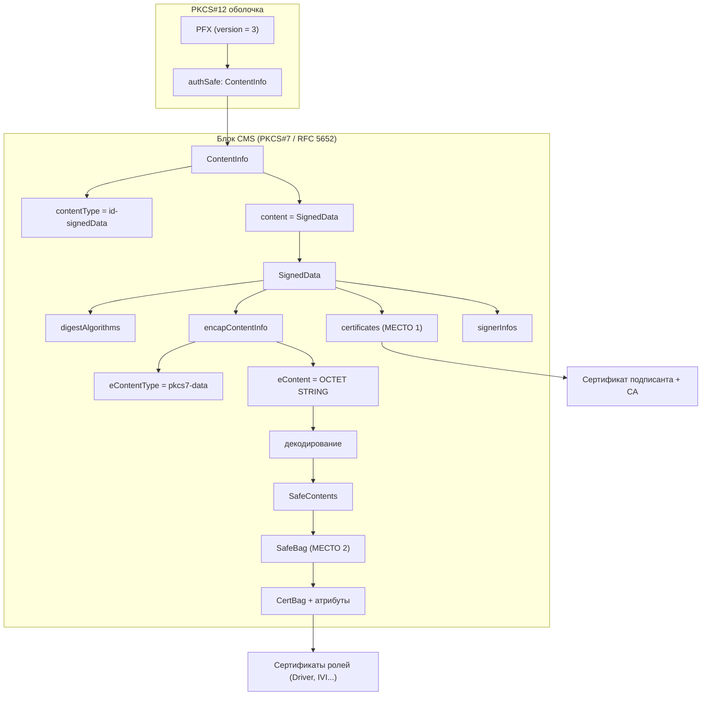
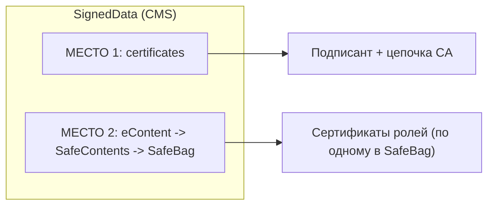
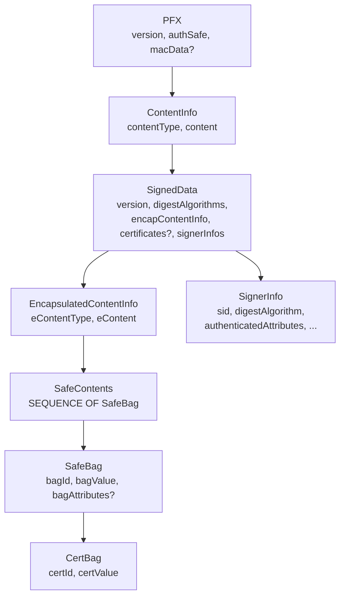

# Архитектура реестров ATOM-PKCS12-REGISTRY и требования для сервисов

Документ описывает архитектуру реестров в формате **ATOM-PKCS12-REGISTRY**, формальную спецификацию формата на основе [registry.asn1](../registry.asn1) и требования при разработке сервисов работы с реестрами.

Он **ссылается на утилиты проекта** (registry-analyzer, registry-builder, p7-analyzer) и предназначен **как рекомендации для разработки собственных сервисов** работы с реестрами формата ATOM-PKCS12-REGISTRY.

---

## Содержание

- [Обзор архитектуры](#обзор-архитектуры)
  - [Диаграмма иерархии контейнера](#диаграмма-иерархии-контейнера-p12)
  - [Диаграмма двух источников сертификатов](#диаграмма-двух-источников-сертификатов)
  - [Текстовая схема уровней структуры](#текстовая-схема-уровней-структуры)
- [Формат реестра (на основе registry.asn1)](#формат-реестра-на-основе-registryasn1)
  - [Схема типов ASN.1](#схема-типов-asn1-registryasn1)
- [Требования при разработке сервисов работы с реестрами](#требования-при-разработке-сервисов-работы-с-реестрами)
- [Ссылки на документацию](#ссылки-на-документацию)

---

## Обзор архитектуры

### Назначение реестров

Реестры в формате ATOM-PKCS12-REGISTRY (.p12) используются для распространения и проверки наборов сертификатов с подписанным содержимым: сертификаты ролей (Driver, Passenger, IVI и т.д.) размещаются в **SafeBags** внутри подписанных данных (eContent), а сертификат подписанта и при необходимости цепочка CA — в **SignedData.certificates**. Целостность и происхождение данных обеспечиваются подписью CMS.

### Уровни структуры

| Уровень           | Описание                                                                                                                                                                                                                                |
| ------------------------ | ----------------------------------------------------------------------------------------------------------------------------------------------------------------------------------------------------------------------------------------------- |
| **Внешний** | Файл .p12 — контейнер**PFX** (PKCS#12), версия 3.                                                                                                                                                                     |
| **authSafe**       | Один**ContentInfo** с `contentType = pkcs7-signedData` (не стандартный AuthenticatedSafe из RFC 7292).                                                                                                              |
| **Тело**       | **SignedData** (CMS, RFC 5652): алгоритмы хеширования, encapContentInfo (eContent), certificates, signerInfos.                                                                                                        |
| **eContent**       | Тип pkcs7-data; значение после декодирования —**SafeContents** (SEQUENCE OF SafeBag). В каждом SafeBag — CertBag с X.509 и атрибуты (roleName, roleValidityPeriod, localKeyID и т.д.). |
| **Подпись** | SignerInfo с sid (SubjectKeyIdentifier), authenticatedAttributes (VIN, VER, UID, roleName, roleValidityPeriod, contentType, messageDigest).                                                                                                    |

### Диаграмма иерархии контейнера (.p12)

Ниже — визуальная схема вложенности структур. Блок CMS (от ContentInfo до signerInfos) образует один непрерывный фрагмент внутри authSafe.



### Диаграмма двух источников сертификатов

Сертификаты в реестре хранятся в двух местах; оба входят в один блок SignedData.



### Схема уровней структуры

Связи читаются сверху вниз: каждый элемент содержит перечисленные под ним поля или структуры. Стрелка "->" означает "значение поля после декодирования даёт".

```
Файл .p12 (DER)
|
+-- PFX  (version = 3)  <-- PKCS#12 (оболочка)
    |
    +-- version  - целое число 3
    +-- authSafe  - одно значение типа ContentInfo (не SEQUENCE OF)
    |   |
    |   |  === Начало единого блока CMS (PKCS#7, RFC 5652). До "Конец блока" ===
    |   |  один блок: ContentInfo, SignedData, eContent->SafeBag, certs.
    |   |
    |   +-- ContentInfo  <-- CMS: ContentInfo
    |       +-- contentType  = id-signedData (pkcs7-signedData)
    |       +-- content [0]  = SignedData (тело CMS)
    |           |
    |           +-- SignedData  <-- CMS: SignedData
    |               +-- version
    |               +-- digestAlgorithms  - SET OF (напр. SHA-256)
    |               +-- encapContentInfo
    |               |   +-- eContentType  = pkcs7-data
    |               |   +-- eContent [0]  = OCTET STRING
    |               |       |
    |               |       +-- после декодирования eContent  ->  SafeContents
    |               |           +-- SafeContents  = SEQUENCE OF SafeBag
    |               |               |
    |               |               |  [МЕСТО 2: сертификаты ролей (Driver, IVI)]
    |               |               |  Лежат внутри SafeBag, в bagValue (CertBag)
    |               |               |
    |               |               +-- SafeBag (для каждого элемента списка)
    |               |                   +-- bagId         = id-certBag
    |               |                   +-- bagValue = CertBag (DER X.509) <-- сертификат роли
    |               |                   +-- bagAttributes = roleName, roleValidityPeriod, localKeyID
    |               |
    |               |  [МЕСТО 1: сертификаты подписанта и CA (не в SafeBag)]
    |               |  Лежат в отдельном поле SignedData.certificates
    |               |
    |               +-- certificates [0]  - опционально; SET OF Certificate (X.509 DER)
    |               |   +-- сертификат подписанта + цепочка CA  <-- здесь
    |               |
    |               +-- signerInfos  - SET OF SignerInfo (подписанты)
    |                   +-- SignerInfo: sid, digestAlgorithm, authenticatedAttributes,
    |                       digestEncryptionAlgorithm, encryptedDigest
    |   |
    |   |  --- Конец того же блока CMS (граница одного блока) ---
    |   |
    +-- macData  - опционально  <-- снова PKCS#12
```

В схеме выше "Начало" и "Конец" обозначают один и тот же блок CMS (не два разных раздела): от ContentInfo до конца signerInfos. SafeBag и SafeContents лежат внутри этого блока как расшифрованное содержимое eContent в SignedData (CMS). PFX, version и macData относятся к PKCS#12 (RFC 7292).

**Кратко по связям:**

| От кого                        | Связь                                     | К чему                                                                   |
| ------------------------------------ | ---------------------------------------------- | ----------------------------------------------------------------------------- |
| PFX.authSafe                         | является                               | ContentInfo                                                                   |
| ContentInfo.content                  | является                               | SignedData                                                                    |
| SignedData.encapContentInfo.eContent | после декодирования даёт | SafeContents (SEQUENCE OF SafeBag)                                            |
| SafeContents                         | список элементов                | SafeBag (CertBag + атрибуты мешка)                               |
| SignedData.certificates              | список                                   | X.509 сертификаты (подписант и CA)                       |
| SignedData.signerInfos               | список                                   | SignerInfo (подписанты с атрибутами и подписью) |

### Два источника сертификатов (не только SafeBag)

**Нет: не все данные сертификатов лежат внутри SafeBag.** В CMS (PKCS#7) реестра сертификаты находятся в **двух разных местах** (см. диаграмму двух источников выше):

| Где в структуре CMS              | Что там лежит                                                                                                                                            | В SafeBag?                                                   |
| --------------------------------------------- | ------------------------------------------------------------------------------------------------------------------------------------------------------------------- | ------------------------------------------------------------- |
| **SignedData.certificates**             | Сертификат подписанта и при необходимости цепочка CA (X.509).                                                           | **Нет** — отдельное поле SignedData.   |
| **eContent → SafeContents → SafeBag** | Сертификаты ролей (Driver, Passenger, IVI и т.д.) — по одному в каждом SafeBag, вместе с атрибутами мешка. | **Да** — в bagValue (CertBag) внутри SafeBag. |

**SafeBags — в каком контейнере?** SafeBags используются в контейнере **.p12** (ATOM-PKCS12-REGISTRY). В файлах **.p7** (голый CMS без обёртки PFX) eContent может быть в другом формате (например PEM-цепочки, не SafeBags).

### Связь с утилитами проекта

| Утилита              | Назначение в архитектуре                                                                                                                                                                           |
| --------------------------- | ------------------------------------------------------------------------------------------------------------------------------------------------------------------------------------------------------------------------ |
| **registry-analyzer** | Разбор .p12, извлечение обоих слоёв сертификатов, атрибутов подписанта и SafeBags; экспорт в PEM/JSON. Эталон поведения парсера. |
| **registry-builder**  | Сборка .p12 по конфигу: подписант (сертификат + ключ), атрибуты (VIN, VER, UID), SafeBags с ролями. Эталон формирования контейнера.     |
| **p7-analyzer**       | Анализ "голого" CMS (.p7) без обёртки PFX — например списки пининга сертификатов. Отдельный формат, те же принципы CMS.               |

---

## Формат реестра (на основе registry.asn1)

**Что такое ASN.1 и зачем он нужен.** ASN.1 (Abstract Syntax Notation One) — язык описания структур данных и правил их кодирования, широко используется в криптографии (X.509, PKCS#7/CMS, PKCS#12). По описанию в ASN.1 строят бинарное представление (например DER). Файл [registry.asn1](../registry.asn1) задаёт в нотации ASN.1 структуру реестра ATOM-PKCS12-REGISTRY (PFX, SignedData, SafeBag и т.д.).

Спецификация формата определена в [registry.asn1](../registry.asn1). Ниже — структурированное описание типов и полей.

### Идентификаторы объектов (OID)

Базовые ветви (из registry.asn1):

| OID                        | Имя                     | Описание                   |
| -------------------------- | -------------------------- | ---------------------------------- |
| 1.2.840.113549.1.7         | pkcs-7                     | PKCS#7 (CMS)                       |
| 1.2.840.113549.1.7.1       | id-data                    | pkcs7-data                         |
| 1.2.840.113549.1.7.2       | id-signedData              | pkcs7-signedData                   |
| 1.2.840.113549.1.9         | pkcs-9                     | Атрибуты PKCS#9            |
| 1.2.840.113549.1.9.3       | id-contentType             | contentType                        |
| 1.2.840.113549.1.9.4       | id-messageDigest           | messageDigest                      |
| 1.2.840.113549.1.9.20      | id-friendlyName            | friendlyName                       |
| 1.2.840.113549.1.9.21      | id-localKeyID              | localKeyID                         |
| 1.2.840.113549.1.12        | pkcs-12                    | PKCS#12                            |
| 1.2.840.113549.1.12.10.1.3 | id-certBag                 | CertBag                            |
| 1.3.6.1.4.1.99999.1        | atom-attributes            | Атрибуты ATOM (enterprise) |
| 1.3.6.1.4.1.99999.1.1      | id-atom-vin                | VIN                                |
| 1.3.6.1.4.1.99999.1.2      | id-atom-ver                | VER (версия/время)      |
| 1.3.6.1.4.1.99999.1.3      | id-atom-uid                | UID                                |
| 1.3.6.1.4.1.99999.1.4      | id-atom-roleName           | roleName                           |
| 1.3.6.1.4.1.99999.1.5      | id-atom-roleValidityPeriod | roleValidityPeriod                 |

Типы сертификатов в CertBag: x509Certificate (1.2.840.113549.1.9.22.1), sdsiCertificate (1.2.840.113549.1.9.22.2).

### Схема типов ASN.1 (registry.asn1)

Связь основных типов по спецификации:



### Верхний уровень: PFX (PKCS#12)

- **PFX**: version (3), authSafe (ContentInfo), macData (опционально).
- **authSafe** — один объект ContentInfo (в ATOM-PKCS12-REGISTRY не SEQUENCE OF ContentInfo).

### ContentInfo (authSafe)

- **contentType** — должен быть id-signedData (1.2.840.113549.1.7.2).
- **content** [0] — тело типа SignedData (CMS).

### SignedData (CMS)

- **version**, **digestAlgorithms** (SET OF AlgorithmIdentifier).
- **encapContentInfo**: eContentType = id-data (pkcs7-data), eContent [0] = OCTET STRING (после декодирования — SafeContents).
- **certificates** [0] — опционально; SET OF Certificate (X.509 DER).
- **signerInfos** — SET OF SignerInfo.

### SignerInfo и идентификация подписанта

- **sid** — в формате реестра используется вариант [0] SubjectKeyIdentifier. Сервис ищет в SignedData.certificates сертификат с совпадающим SubjectKeyId — это сертификат подписанта.
- **authenticatedAttributes** — SET OF Attribute (contentType, messageDigest, атрибуты ATOM).

### Атрибуты ATOM и типы значений

| Атрибут     | OID                   | Тип значения (ASN.1)                                          | Назначение                                                   |
| ------------------ | --------------------- | ------------------------------------------------------------------------ | ---------------------------------------------------------------------- |
| VIN                | 1.3.6.1.4.1.99999.1.1 | UTF8String                                                               | Идентификатор транспортного средства |
| VER                | 1.3.6.1.4.1.99999.1.2 | SEQUENCE { timestamp GeneralizedTime, versionNumber INTEGER }            | Время и номер версии реестра                   |
| UID                | 1.3.6.1.4.1.99999.1.3 | UTF8String                                                               | Идентификатор подписанта                        |
| roleName           | 1.3.6.1.4.1.99999.1.4 | UTF8String                                                               | Имя роли (у подписанта или в мешке)         |
| roleValidityPeriod | 1.3.6.1.4.1.99999.1.5 | SEQUENCE { notBeforeTime GeneralizedTime, notAfterTime GeneralizedTime } | Срок действия роли                                     |

В SignerInfo также присутствуют стандартные атрибуты: contentType (pkcs9), messageDigest (OCTET STRING).

### eContent: SafeContents и SafeBag

- **SafeContents** — SEQUENCE OF SafeBag.
- **SafeBag**: bagId = id-certBag, bagValue [0] = CertBag, bagAttributes (опционально).
- **CertBag**: certId (тип сертификата), certValue [0] = OCTET STRING (DER X.509).
- **bagAttributes** — roleName, roleValidityPeriod (GeneralizedTime), localKeyID (OCTET STRING), friendlyName (опционально).

Декодирование eContent: из SignedData.encapContentInfo извлекается OCTET STRING; его значение — DER-кодированная SafeContents (SEQUENCE OF SafeBag).

### Кодирование и теги

- **certificates** в SignedData в ASN.1 заданы как [0] IMPLICIT; в реализации может использоваться SET или SEQUENCE для набора сертификатов.
- Длины в DER кодируются минимальным числом байт (без лишних ведущих нулей).
- **authenticatedAttributes** при подписи кодируются как SET OF и участвуют в расчёте messageDigest.

---

## Требования при разработке сервисов работы с реестрами

Требования ниже сформулированы на основе поведения утилит registry-analyzer, registry-builder и p7-analyzer. Их соблюдение обеспечивает совместимость сервисов с эталонными контейнерами.

### 1. Разбор контейнера (.p12)

| Требование                                      | Описание                                                                                                                                                                                                                                                                                         |
| --------------------------------------------------------- | -------------------------------------------------------------------------------------------------------------------------------------------------------------------------------------------------------------------------------------------------------------------------------------------------------- |
| **Версия PFX**                                | Принимать только version = 3. При ином значении возвращать ошибку.                                                                                                                                                                                         |
| **Тип authSafe**                                 | Проверять, что authSafe — один ContentInfo с contentType = id-signedData (1.2.840.113549.1.7.2). Не предполагать AuthenticatedSafe (SEQUENCE OF ContentInfo) из классического PKCS#12.                                                                    |
| **Два слоя сертификатов**        | Различать SignedData.certificates (сертификаты для подписи/доверия) и eContent (SafeContents) — сертификаты ролей. Оба слоя обрабатывать и при необходимости экспортировать раздельно. |
| **Идентификация подписанта** | Определять сертификат подписанта по SignerInfo.sid (SubjectKeyIdentifier); искать в SignedData.certificates сертификат с совпадающим SubjectKeyId.                                                                                          |
| **eContentType**                                    | Для eContent ожидать eContentType = id-data (pkcs7-data). Декодировать eContent как SafeContents (SEQUENCE OF SafeBag).                                                                                                                                                         |
| **Без пароля**                             | Не требовать пароль для разбора типичного реестра (macData опционально не используется).                                                                                                                                             |

Рекомендуется ориентироваться на логику разбора в internal/registry/parse.go.

### 2. Валидация и целостность

| Требование               | Описание                                                                                                                                                                                                                                                                                                                                                                         |
| ---------------------------------- | ---------------------------------------------------------------------------------------------------------------------------------------------------------------------------------------------------------------------------------------------------------------------------------------------------------------------------------------------------------------------------------------- |
| **Структура ASN.1** | Разбирать контейнер строго по[registry.asn1](../registry.asn1). Лишние байты после PFX считать ошибкой.                                                                                                                                                                                                                             |
| **Подпись CMS**       | При необходимости проверки подписи использовать сертификат подписанта из SignedData.certificates, алгоритмы из SignerInfo (digestAlgorithm, digestEncryptionAlgorithm) и authenticatedAttributes в том порядке, в котором они участвуют в расчёте digest (RFC 5652). |
| **Сроки**               | Проверять срок действия сертификатов (notBefore, notAfter) и при наличии — сроки ролей (roleValidityPeriod в мешках и у подписанта).                                                                                                                                                                           |

### 3. Сборка реестров (.p12)

| Требование                               | Описание                                                                                                                                                                                                                                                                                                                                                                                                                                   |
| -------------------------------------------------- | -------------------------------------------------------------------------------------------------------------------------------------------------------------------------------------------------------------------------------------------------------------------------------------------------------------------------------------------------------------------------------------------------------------------------------------------------- |
| **Конфигурация**                 | Поддерживать входные данные: сертификат и ключ подписанта (PEM), атрибуты подписанта (VIN, VER, UID), список SafeBags (сертификат + roleName, roleNotBefore/roleNotAfter, localKeyID). Формат конфига — по[REGISTRY_BUILDER.md](REGISTRY_BUILDER.md) и примеру [registry-builder-config.example.json](registry-builder-config.example.json). |
| **Подписант**                       | В SignedData.certificates включать сертификат подписанта. SignerInfo формировать с sid = SubjectKeyIdentifier, authenticatedAttributes — в порядке, требуемом для проверки подписи (contentType, messageDigest, ATOM-атрибуты). Ключ подписанта — ECDSA P-256 в текущей реализации registry-builder.                         |
| **SafeBags**                                 | Каждый мешок: bagId = id-certBag, CertBag с certId (x509Certificate), certValue = DER X.509; bagAttributes — roleName, roleValidityPeriod (GeneralizedTime), localKeyID (OCTET STRING).                                                                                                                                                                                                                                               |
| **Именование файлов**        | Выходной файл реестра должен иметь имя с префиксом `sgw-` (например sgw-my-registry.p12, sgw-IVI_Certificate_registry.p12).                                                                                                                                                                                                                                                                   |
| **Проверка после сборки** | Созданный реестр должен успешно разбираться эталонным парсером (registry-analyzer).                                                                                                                                                                                                                                                                                                        |

Рекомендуется использовать или сверяться с internal/registry/builder.go.

### 4. Экспорт и интеграция

| Требование         | Описание                                                                                                                                                                                                                                                                                                                                                                                                                                                                                                                                                                                    |
| ---------------------------- | --------------------------------------------------------------------------------------------------------------------------------------------------------------------------------------------------------------------------------------------------------------------------------------------------------------------------------------------------------------------------------------------------------------------------------------------------------------------------------------------------------------------------------------------------------------------------------------------------- |
| **PEM**                | Поддерживать выгрузку сертификатов в PEM (один файл со всеми или по одному файлу на сертификат). Имена файлов при выгрузке по одному: по roleName подписанта для SignedData.certificates; по roleName и Serial для SafeBags (см. registry-analyzer).                                                                                                                                                                                                               |
| **JSON**               | При машинной обработке предоставлять структурированный вывод: метаданные контейнера, массив сертификатов (subject, issuer, serial, сроки, алгоритмы, расширения, SAN, raw DER или PEM), массив SafeBags с атрибутами, данные подписантов и атрибуты (VIN, VER, UID, roleName, roleValidityPeriod). Для форматов типа .p7 в JSON включать поле**pem** у каждого сертификата. |
| **Подписант** | Возможность выгружать только сертификат подписанта (например для проверки подписи или доверия в другом сервисе).                                                                                                                                                                                                                                                                                                                                                                                    |

### 5. Смежный формат CMS/PKCS#7 (.p7)

| Требование                    | Описание                                                                                                                                                                                                                                                                                                                                                                                                                                                                                                                                                                                                                     |
| --------------------------------------- | ------------------------------------------------------------------------------------------------------------------------------------------------------------------------------------------------------------------------------------------------------------------------------------------------------------------------------------------------------------------------------------------------------------------------------------------------------------------------------------------------------------------------------------------------------------------------------------------------------------------------------------ |
| **Отличие от .p12**      | Контейнеры .p7 — "голый" CMS (один ContentInfo с SignedData), без обёртки PFX. eContent может быть не SafeContents (DER), а текстом с PEM-сертификатами (списки пининга). Сервисам, работающим только с реестрами .p12, достаточно поддерживать формат по registry.asn1; для анализа .p7 использовать отдельную логику (например p7-analyzer) или явно документировать поддержку двух форматов. |
| **Единые принципы** | В .p7 также есть SignedData.certificates и eContent; идентификация подписанта по SubjectKeyIdentifier; при JSON-выводе включать PEM-блоки сертификатов для удобства.                                                                                                                                                                                                                                                                                                                                                                                |

### 6. Окружение и зависимости

Ниже — анализ реализации утилит проекта и рекомендации по настройкам и переменным среды окружения для собственных сервисов работы с реестрами ATOM-PKCS12-REGISTRY.

**Анализ реализации утилит**

| Аспект                                      | registry-analyzer                                                                                                                 | registry-builder                                                                                                                         | p7-analyzer                            |
| ------------------------------------------------- | --------------------------------------------------------------------------------------------------------------------------------- | ---------------------------------------------------------------------------------------------------------------------------------------- | -------------------------------------- |
| **Переменные окружения** | Не используются                                                                                                     | Не используются                                                                                                            | Не используются          |
| **Конфигурация**                | Только аргументы командной строки (флаги)                                                      | Флаги `-config`, `-output` + JSON-файл конфигурации                                                             | Только флаги                |
| **Пути к файлам**                | Относительные пути разрешаются от**текущей рабочей директории (CWD)** | Путь к конфигу и пути внутри конфига — относительные от**CWD** при запуске | Аналогично                   |
| **Вывод (цвет, TTY)**              | Флаги `-no-color`, `-color` (auto/always/never); проверка TTY по stdout                                        | Нет цветного вывода                                                                                                     | Аналогично registry-analyzer |
| **Зависимости**                  | Только стандартная библиотека Go                                                                       | То же + чтение JSON-конфига                                                                                             | То же                              |

В коде утилит отсутствуют вызовы `os.Getenv` / `os.Environ`; конфигурация задаётся флагами и (для registry-builder) содержимым JSON-файла. Цветной вывод управляется только флагами `-no-color` и `-color`.

**Рекомендации по настройкам и переменным окружения**

| Рекомендация                                               | Описание                                                                                                                                                                                                                                                                                                                                                                                                                                                                       |
| ---------------------------------------------------------------------- | -------------------------------------------------------------------------------------------------------------------------------------------------------------------------------------------------------------------------------------------------------------------------------------------------------------------------------------------------------------------------------------------------------------------------------------------------------------------------------------- |
| **Переменные окружения**                      | Утилиты не используют переменные окружения; всё задаётся флагами и конфигом. Для сервисов: не вводить переменные либо ввести и**задокументировать** (путь к конфигу, базовая директория, логирование). Не смешивать недокументированные переменные с флагами. |
| **Базовая директория для путей**        | В утилитах относительные пути — от**CWD**. В сервисах CWD может быть неочевидной. Рекомендуется: **абсолютные пути** в конфиге либо переменная окружения (например `REGISTRY_BASE_DIR`) как база для относительных путей; описать в документации.                                            |
| **Конфигурационный файл (registry-builder)** | Путь к конфигу — флаг `-config`. Пути внутри конфига (signerCert, signerKey, safeBags[].cert) — относительные от CWD. Для сервисов: конфиг в известном месте; пути к PEM и .p12 — абсолютные или относительно одной базы.                                                                                                                                 |
| **Цвет и машиночитаемый вывод**          | Цвет — при TTY и `-color=auto`; `-no-color` / `-color=never` отключают. При поддержке переменных окружения учитывать **NO_COLOR** (непустое значение — отключить цвет), не отменяя явные флаги.                                                                                                                                                                 |
| **Криптография**                                     | Использовать те же алгоритмы, что и в registry-builder и эталонных реестрах: ECDSA (P-256), SHA-256. Зависимости ограничивать стандартной библиотекой Go или явно документировать иные библиотеки.                                                                                                                                                    |
| **Повторяемость запуска**                    | Для скриптов и CI: фиксировать CWD или использовать абсолютные пути; при выводе в файл/пайп цвета не применяются (нет TTY).                                                                                                                                                                                                                                                                 |

---

## Ссылки на документацию

| Документ                            | Описание                                                                      |
| ------------------------------------------- | ------------------------------------------------------------------------------------- |
| [registry.asn1](../registry.asn1)              | Спецификация ASN.1 формата ATOM-PKCS12-REGISTRY.                   |
| [README.md](../README.md)                      | Обзор утилит, запуск, опции.                                    |
| [WORKFLOW.md](WORKFLOW.md)                     | Пошаговый workflow анализа контейнера PKCS#12.              |
| [REGISTRY_BUILDER.md](REGISTRY_BUILDER.md)     | Инструкция по registry-builder (конфиг, SafeBags, примеры).  |
| [PKCS7_CMS_ANALYSIS.md](PKCS7_CMS_ANALYSIS.md) | Анализ формата CMS (.p7), отличия от .p12.                      |
| [OPENSSL_VERIFY.md](OPENSSL_VERIFY.md)         | Проверка контейнера и сертификатов через OpenSSL. |
